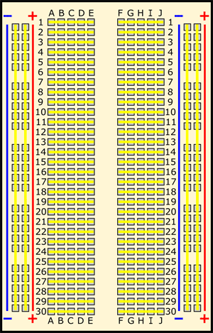

* [30个Python物联网小实验1：三行代码点亮LED灯](#30个python物联网小实验1三行代码点亮led灯)
	* [三行代码点亮LED灯](#三行代码点亮led灯)
	* [LED灯闪烁](#led灯闪烁)
	* [LED灯调亮度](#led灯调亮度)
	* [LED淡入淡出](#led淡入淡出)
	* [不写一行代码点亮LED灯](#不写一行代码点亮led灯)
	* [全彩RGB灯](#全彩rgb灯)
	* [面包板](#面包板)

## 30个Python物联网小实验1：三行代码点亮LED灯

>以下所有实验均要求树莓派刷入完整版`Raspbian`操作系统，也就是官网上`Raspbian Stretch with desktop and recommended software`的版本。

### 三行代码点亮LED灯

- 接线图如下：


- 代码如下：

```py
from gpiozero import LED

red = LED(17)

while True:red.on()
```

- 在终端运行`python3 LED.on.py`即可点亮LED灯！


### LED灯闪烁

- 新建`LED.blink.py`文件，代码如下：

```py
from gpiozero import LED
from signal import pause

red = LED(17)

red.blink()

pause()
```

核心在于`on()`方法改成了`blink()`方法，再运行`python3 LED.blink.py`即可闪烁！

### LED灯调亮度

- 新建`LED.pwn.py`文件，代码如下：

```py
from gpiozero import PWMLED
from time import sleep

led = PWMLED(17)

while True:
    led.value = 0  # 全灭
    sleep(1)
    led.value = 0.5  # 半亮
    sleep(1)
    led.value = 1  # 全亮
    sleep(1)
```

核心在于使用的类改为`PWMLED`，不再是`LED`类了。在命令行界面运行`python3 LED.pwn.py`之后，可以看到`LED`灯全灭、半亮、全亮，间隔`1s`，交替运行。

### LED淡入淡出

- 新建`LED.pulse.py`文件，代码如下：

```py
from gpiozero import PWMLED
from signal import pause

led = PWMLED(17)

led.pulse()

pause()
```

核心在于使用了`pulse()`函数，可以观察到`led`等淡入淡出的效果！

### 不写一行代码点亮LED灯

- 在命令行界面使用`pinout`命令，输出各针脚定义。


- (2)号口`5v`电压接`1kΩ`的电阻，接`LED`长脚正极，`LED`负极接(6)号GND地线负极，这样`LED`灯直接就会点亮，不写一行代码！


### 全彩RGB灯

- 红绿蓝分别接`GPIO(2)、GPIO(3)、GPIO(4)`口，新建`RGBLED.py`文件，代码如下：

```py
RGBLED.py 
from __future__ import division  # required for python 2
from gpiozero import RGBLED
from time import sleep

led = RGBLED(red=2, green=3, blue=4)

led.red = 1  # full red
sleep(1)
led.red = 0.5  # half red
sleep(1)

led.color = (0, 1, 0)  # full green
sleep(1)
led.color = (1, 0, 1)  # magenta
sleep(1)
led.color = (1, 1, 0)  # yellow
sleep(1)
led.color = (0, 1, 1)  # cyan
sleep(1)
led.color = (1, 1, 1)  # white
sleep(1)

led.color = (0, 0, 0)  # off
sleep(1)

# slowly increase intensity of blue
for n in range(100):
    led.blue = n/100
    sleep(0.1)

```

- 在命令行界面，运行以上代码`python RGBLED.py`，则`RGBLED`灯颜色不断变化，效果如下：


### 面包板

也称为无焊接面包板，是我们进行物理和电子实验的好帮手，由于其内部集成了走线，从而避免了复杂实验时杂乱无章的飞线。面包上的针脚孔可以轻松地搭配众多带针脚的传感器使用，许多传感器和面包板都包含了配电的部分，使得包含面包板的电路实验设计变得更加容易。一句话总结一下，我们做实验并非一定要用到面包板，但是有个面包板可以使我们事半功倍。



面包板有几个特性：
- 左右两侧为正负极。正负极下方各有各的金属片，竖排相连。
- 中间两侧为通用端口，左侧和右侧互不相同。
- 中间两侧的针孔下方横向相连。

举个例子从从`A1到E1`是相连接的，从`F1`到`J1`是相连接的，但是`E1`和`F1`是不通的。树莓派的`5v`或者`3v3`只要接到`+`级的任何一个孔，整个`+`级的竖排都会存在相应电压的供电，树莓派的`GND`接`-`级。下图是一个真实的面包板。


好了，本次介绍就到这里，这个系列的全文会收录在我的github目录，欢迎大家star和沟通：[https://github.com/asukafighting/RaspberryPiHacker](https://github.com/asukafighting/RaspberryPiHacker)