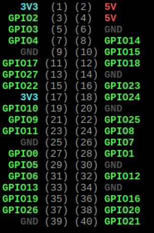

* [30个Python物联网小实验5：光线感应灯](#30个python物联网小实验5光线感应灯)
	* [光线传感器](#光线传感器)
	* [光线变化执行函数](#光线变化执行函数)
	* [光线状态执行函数](#光线状态执行函数)

## 30个Python物联网小实验5：光线感应灯


### 光线传感器

- 可以检测周围环境的亮度；
- 方向性较好，感知特定方向的亮度；
- 灵敏度可调，用螺丝刀旋转图中蓝色电位器即可；
- 工作电压：3.3v~5v
- 数字开关输出：0或1
- 设有固定螺栓孔，方便安装

### 光线变化执行函数

- 接线方法：正极接树莓派的5v正极，负极接树莓派的GND地线，信号输出针脚接`GPIO18`号口。



- 上代码：

```py
from gpiozero import LightSensor

sensor = LightSensor(18)

while True:
    sensor.wait_for_light()
    print("It's dark! :)")
    sensor.wait_for_dark()
    print("It's light! :(")
```

- 可以看到代码的核心就是`wait_for_light()`和`wait_for_dark()`这两个函数，手遮挡住光线的时候，显示`"It's dark! :)"`，手拿开之后，显示`"It's light! :("`。

### 光线状态执行函数

- 上代码：

```py
from gpiozero import LightSensor, LED
from signal import pause

sensor = LightSensor(18)
led = LED(17)

sensor.when_dark = led.off
sensor.when_light = led.on

pause()
```

- 代码的核心在于将`sensor`的状态直接提供给`led`，这样光线传感器检测到亮光的时候`led`熄灭，检测不到光线的时候，`led`点亮。

好了，本次介绍就到这里，这个系列的全文会收录在我的`github`目录，欢迎大家`star`和沟通：[https://github.com/asukafighting/RaspberrypiHandbyHand](https://github.com/asukafighting/RaspberrypiHandbyHand)