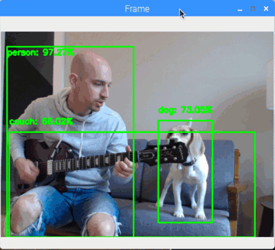
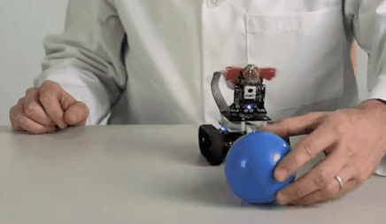
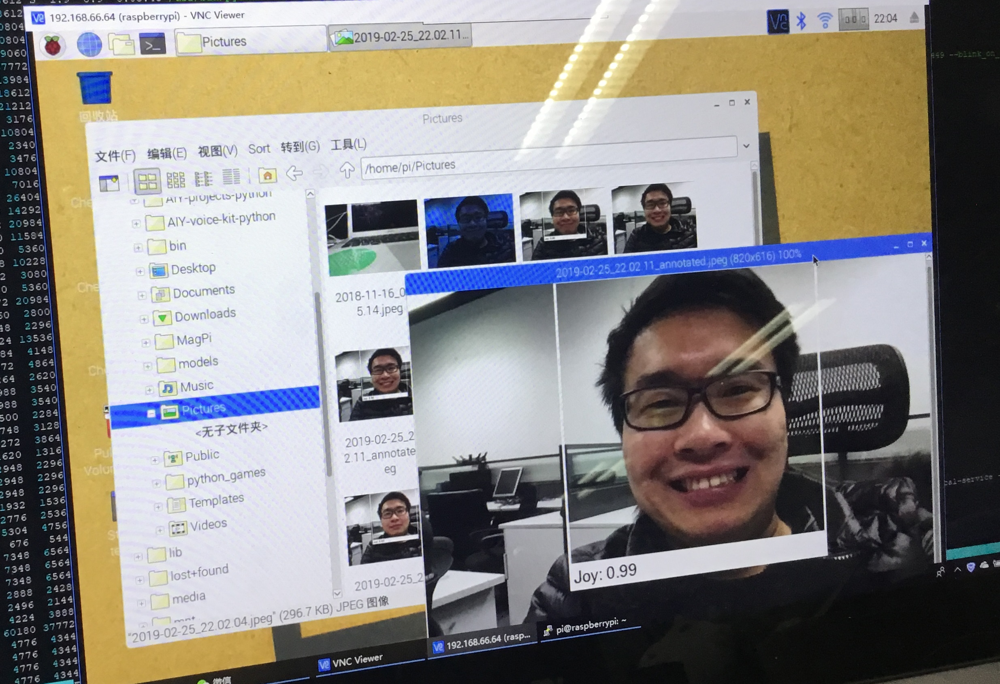

# 手把手教你玩树莓派

树莓派自从面世以来，在世界范围内获得了巨大的成功，大家非常喜欢这块小板子，绞尽脑汁将它应用到生产和生活中去，诞生出众多奇思妙想却又精妙绝伦的创意项目。尤其是时间进入到`2019`年，**RaspberryPi + AI**、**RaspberryPi + iot**、**RaspberryPi + Robot**等树莓派搭配**人工智能**、**物联网**和**机器人**的项目层出不穷，这些项目充满创意、贴近生活，是前沿科技结合实际落地的典型场景。

树莓派最初设计的用途就是用于教育，它成本低廉，却又性能强劲，它质量可靠，从课堂、客厅到生产车间，都可以找到它的身影。树莓派覆盖了学习理论知识、动手实际组装搭建、到生产环境应用的完整教育生命周期，**任何人亲自动手将本目录中的所有项目实际操作一遍，那么对于电路、系统、视觉、传感器等概念和应用，都会有一个巨大的飞跃**，任何人都可以在生产、生活环境中，应用最新的**人工智能、物联网和机器人**技术，因为，这些本来就并不是那么难，只要学好、完好树莓派，这些都能够做到。

树莓派的性能不是最强的，性价比也不是最高的，但最成功的的确是它。树莓派的成功，最大的源泉在于其拥有**一个良好的社区，一个互相分享、帮助的社区**，我把这个目录的名称确定为《手把手教你玩树莓派》原因也正是如此。**网上树莓派知识良莠不齐，有些早已过时**，然而新手却无从分辨，导致实验失败的情况比比皆是，而有前辈**社区老鸟带着学习，效果将会完全不同**，`社区的力量`才是玩转树莓派的真谛！

眼前我将把主要精力放在完善教程，打造线上的交流平台，比如群、微博、论坛等等，手把手教大家完成这些项目；日后也会组织线下的聚会、WorkShop等活动，跟大家面对面一起交流、完成这些项目，让所有人一起享受玩转树莓派的乐趣。目标是营造最好的学习树莓派的氛围，打造国内最好的树莓派学习社区，让每个人都能用上基于树莓派的`AI`物联网智能家居。

我的**微信/微博ID**：`asukafighting` ，想要一起玩的，可以加我入群 ^.<

# 主要项目

## 01.Robot：**机器人**

- [30个Python物联网小实验1：三行代码点亮LED灯](01.Robot)
- [30个Python物联网小实验2：模拟红绿灯](01.Robot)
- [30个Python物联网小实验3：使用按钮开灯关灯](01.Robot)
- [30个Python物联网小实验4：蜂鸣器播放星球大战](01.Robot)
- [30个Python物联网小实验5：光线感应灯](01.Robot)
- [30个Python物联网小实验6：人体感应器](01.Robot)

## 02.AI：**人工智能**

## 03.MagicMirror：**魔镜**

## 04.InternetOfThings：**物联网**